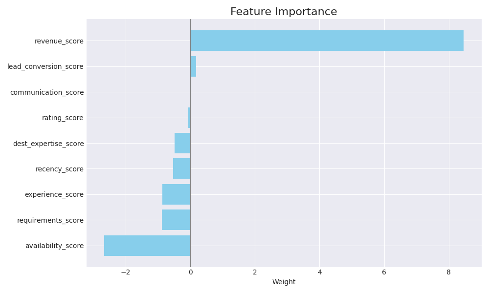

# Astra Luxury Travel: Agent Assignment Algorithm

## Overview

This project implements a real-time, data-driven algorithm to match prospective customers with the ideal Astra space travel agent. The system analyzes historical performance data to predict which agent is most likely to secure a booking, ensuring each customer is paired with an agent equipped to meet their needs and upsell luxury packages. The result is a system designed to improve booking rates, increase total revenue, and provide a superior customer journey.

***

### How It Works: The "Match Score"

The core of the system is the **Match Score**, a single number on a 0-100 scale that ranks each agent's suitability for a new customer. The score is calculated by the `AssignBestAgents` SQL procedure, which evaluates agents on nine key performance features. These features are weighted based on a logistic regression model trained on historical booking data to identify the factors that most strongly correlate with a successful booking.

***

### Understanding Feature Importance

The model automatically learns how important each feature is in predicting a successful booking. Some features have a **positive** importance (a good sign), while others have a **negative** importance (a potential warning sign).

* **Positive Importance (Good Signs)**
    A feature with positive importance, like `revenue_score`, directly increases an agent's `MatchScore`. The higher an agent scores in this area, the more the model recommends them.

* **Negative Importance (Warning Signs)**
    A feature with negative importance, like `availability_score`, acts as a penalty. The model observed that agents with a low availability score (meaning they are very busy) were often the most successful. The model learned this pattern and will penalize agents who are *too* available, as it may indicate they are not in high demand. This reveals a key insight: availability should be treated more as a simple "yes/no" filter rather than a factor of skill.

Here is a simple breakdown of each feature:

* **Revenue Score**: The total revenue an agent has generated from past confirmed bookings. This is the strongest indicator of an agent's ability to close high-value deals.
* **Availability Score**: An agent's current capacity to take on new assignments.
* **Experience Score**: The number of years an agent has been with Astra.
* **Requirements Score**: A flag that gives a boost to agents in the "Luxury Voyages" department when a customer's request includes luxury keywords.
* **Recency Score**: A measure of an agent's recent success, based on confirmed bookings in the last 30 days of the data.
* **Destination Expertise Score**: An agent's success rate for the specific destination the customer is interested in.
* **Rating Score**: The agent's average customer service rating.
* **Communication Score**: An agent's success rate with the customer's preferred communication method.
* **Lead Conversion Score**: An agent's historical success rate with the customer's lead source.

***

## Sample Results

The final output is a ranked list of agents and their **Match Score**. The example below is the direct result of running the `test.sql` script, which simulates a customer interested in a luxury trip to Mars.

|   AgentID | AgentName     |   MatchScore |
|----------:|:--------------|-------------:|
|        19 | Calypso White |        100   |
|         6 | Soren Baker   |         91   |
|        17 | Lyra Morgan   |         90.2 |
|         7 | Mira Patel    |         83.7 |
|        27 | Ronan Young   |         81.8 |
|         3 | Nova Singh    |         76.9 |
|         5 | Vera Nguyen   |         74.2 |
|        12 | Nia Ramirez   |         66   |
|        28 | Mila Reed     |         63.9 |
|        23 | Cassian Ward  |         63.4 |
|        25 | Enzo Nguyen   |         60.4 |
|        24 | Phoebe Diaz   |         60   |
|        11 | Elias Walker  |         57.1 |
|        13 | Atlas Foster  |         57.1 |
|        20 | Orla Patel    |         53   |
|         9 | Luna Martinez |         47.1 |
|         1 | Aurora Tanaka |         45.4 |
|        22 | Juno Brooks   |         44.8 |
|        18 | Dax Reyes     |         39.3 |
|        30 | Zuri Bennett  |         38.7 |
|        15 | Rhea Chen     |         36.7 |
|         4 | Leo Kim       |         36.1 |
|        14 | Selene Ali    |         29.3 |
|        10 | Zara Khan     |         17.8 |
|        21 | Arlo Scott    |         13.1 |
|        26 | Vega Price    |         12   |
|         2 | Kai Rodriguez |         11.7 |
|        29 | Sage Cooper   |          7   |
|        16 | Zion Parker   |          4.9 |
|         8 | Orion Davis   |          0   |

***

## SQL Code

The following files contain the complete and executable SQL code for this project:

* `space_travel_agents.sql`: Creates and populates the `space_travel_agents` table.
* `assignment_history.sql`: Creates and populates the `assignment_history` table.
* `bookings.sql`: Creates and populates the `bookings` table.
* `create_helpers.sql`: Creates the `agent_capacity` and `learned_weights_table` helper tables.
* `analysis.sql`: Creates the `AssignBestAgents` stored procedure.
* `test.sql`: Test script which simulates a customer interested in a luxury trip to Mars.

## Python Code

The following files were used in the development of the model and visual aids for this project:

* `train_weights.py`: Trains weights for the agent assignment model through logistic regression and appends them to the `learned_weights_table` helper table.
* `generate_report.py`: Generates visual aids for the final report, runs `test.sql` to generate sample results, and saves them to results folder.
